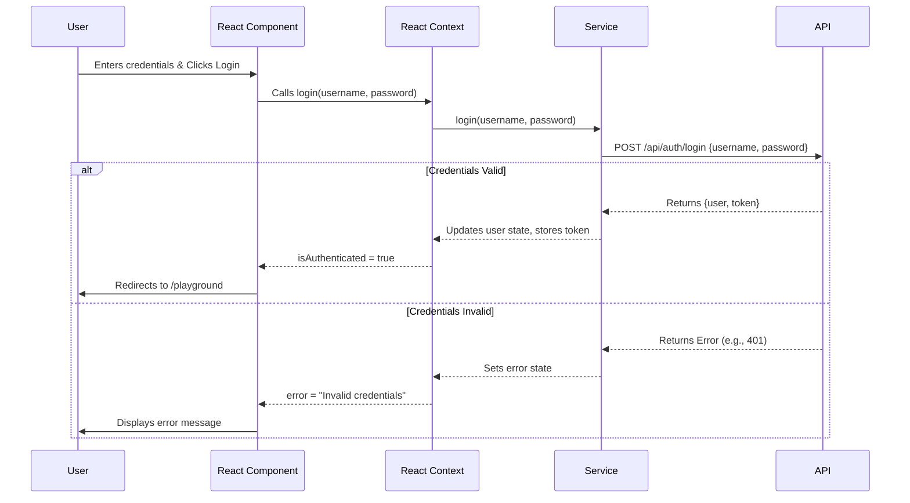
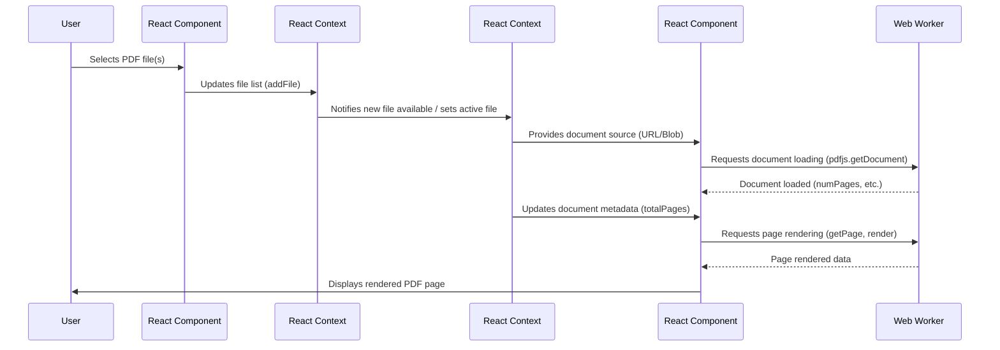
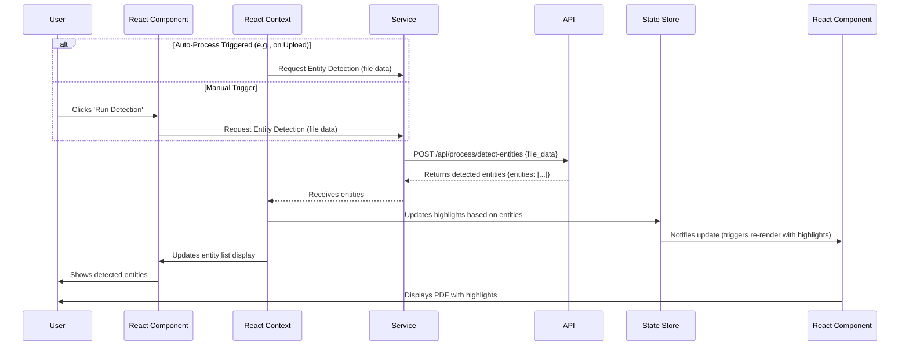

# Hideme 
[]()
[]()
[]()
[]()
[]()

**Welcome to the Hideme project!** This document aims to provide a deep dive into the project's architecture, logic, and the thought processes behind its construction. Whether you're looking to contribute, understand the system, or simply curious, this guide should offer valuable insights.

## Table of Contents

- [Project Overview](#project-overview)
- [Core Features](#core-features)
- [Architecture and Technology Stack](#architecture-and-technology-stack)
- [Installation and Setup](#installation-and-setup)
- [Usage Guide](#usage-guide)
- [Algorithmic Flows and Interactions](#algorithmic-flows-and-interactions)
- [Flow Diagrams](#flow-diagrams)
- [Scenarios and Use Cases](#scenarios-and-use-cases)
- [Testing](#testing)

## Project Overview

Hideme is a web-based application designed primarily for interacting with PDF documents, focusing on features like viewing, searching, entity detection, and redaction. The goal was to build a robust, performant, and user-friendly tool that leverages modern web technologies to handle potentially complex PDF processing tasks directly in the browser where possible, while interfacing with a backend for more intensive operations.

The application is built as a Single Page Application (SPA) using React and TypeScript, ensuring type safety and component-based architecture. It utilizes libraries like `react-pdf` for core PDF rendering and manipulation, alongside a custom-built system of contexts, hooks, services, and managers to handle state, logic, and API interactions.

## Core Features

-   **PDF Viewing**: High-performance PDF rendering with navigation (page jumps, thumbnails), zoom controls, and text layer support.
-   **Authentication**: Secure user login and registration system with session management.
-   **File Management**: Upload and manage multiple PDF documents.
-   **Entity Detection**: Automatic identification of predefined or custom entities within PDF text content (likely requires backend processing).
-   **Text Search**: Search for text patterns or keywords within documents, with results highlighted and navigable.
-   **Redaction**: Tools to select and mark areas for redaction, with the potential to apply these redactions permanently (likely requires backend processing).
-   **Customizable Settings**: User-specific settings for application behavior, entity definitions, ban lists, and search patterns.
-   **Multi-language Support**: Internationalization capabilities with support for English and Norwegian languages, with an easily extendable framework for adding more languages.
-   **Document History**: Storage and retrieval of document redaction history, allowing users to revisit and apply previous redaction mappings to documents.
-   **Encryption and Decryption**: Client-side encryption and decryption of sensitive document data using AES-GCM algorithm, ensuring secure transmission with the backend.
-   **Theming**: Support for light/dark mode.
-   **Responsive Design**: UI adapts to different screen sizes (implied by use of modern web tech).

## Architecture and Technology Stack

The application follows a component-based architecture typical of React applications, enhanced with specific patterns for managing complexity.

**Frontend:**

-   **Framework/Library**: React 19+ with TypeScript
-   **Build Tool**: Vite 6.1.1+
-   **Routing**: `react-router-dom` v7
-   **PDF Rendering**: `react-pdf` v9.2.1 (which uses PDF.js v4.10.38)
-   **PDF Manipulation**: `pdf-lib` v1.17.1
-   **State Management**: React Context API (extensively used), potentially supplemented by a dedicated library like Zustand or Redux Toolkit for specific stores (e.g., `HighlightStore`). Custom hooks (`useAuth`, `useSettings`, `useBanList`, `useEntityDefinitions`, `useSearchPatterns`, `useUserProfile`) encapsulate stateful logic.
-   **Styling**: CSS Modules, standard CSS (`src/styles/`)
-   **UI Components**: Custom components with design system principles
-   **Animation**: `framer-motion` v12.6.3, `motion` v12.4.7
-   **Icons**: `lucide-react` v0.475.0, `react-icons` v5.5.0
-   **Virtual Scrolling**: `react-window` v1.8.11, `react-intersection-observer` v9.16.0
-   **API Communication**: `axios` v1.8.4 (managed via `apiClient.ts` and `apiService.ts`)
-   **Internationalization**: Custom i18n implementation supporting multiple languages (currently English and Norwegian)
-   **Data Storage**: IndexedDB via `idb` v8.0.2 for client-side storage
-   **Encryption**: Web Crypto API for secure client-side encryption

**Backend :**
-   The API interactions are managed through services like `authService.ts`, `userService.ts`, `apiService.ts`.

**Key Architectural Concepts:**

-   **Context Providers**: Centralized state management for different application domains (User, Theme, File, PDF Viewer, etc.). See `src/contexts/`.
-   **Custom Hooks**: Reusable logic extraction, often interacting with contexts or services. See `src/hooks/`.
-   **Services**: Encapsulate API calls and specific business logic (e.g., `ScrollManagerService`, `BatchSearchService`, `BatchEncryptionService`). See `src/services/`.
-   **Managers**: Orchestrate complex workflows involving multiple components or services (e.g., `AutoProcessManager`, `EntityHighlightProcessor`). See `src/managers/`.
-   **Modularity**: Code is organized by feature (e.g., components/pdf, contexts/PDFViewerContext) or type (hooks, services, managers).
-   **Asynchronous Operations**: Heavy reliance on Promises and async/await for handling API calls and PDF.js worker interactions.

**Project Structure (`src/` directory):**

```
src/
├── App.tsx                 # Main application component, context provider setup
├── main.tsx                # Application entry point, React DOM rendering, PDF.js worker setup
├── assets/                 # Static assets like images, videos
├── components/             # Reusable UI components
│   ├── common/             # Common UI components used throughout the app
│   ├── forms/              # Form components and controls
│   ├── pdf/                # PDF-specific components
│   │   ├── highlighters/   # Components for highlighting text in PDFs
│   │   ├── pdf-page-components/ # PDF page-level components (like HistoryViewer)
│   │   └── pdf-viewer-components/ # PDF viewer components
│   ├── settings/           # Settings-related components
│   │   └── tabs/           # Tab components for settings sections
│   └── static/             # Static content components
├── contexts/               # React Context providers and consumers
├── hooks/                  # Custom React hooks for stateful logic
│   ├── auth/               # Authentication-related hooks
│   ├── general/            # General utility hooks (including useDocumentHistory)
│   └── settings/           # Settings management hooks
├── managers/               # Classes/functions orchestrating complex processes
├── pages/                  # Top-level page components corresponding to routes
│   ├── dynamic-pages/      # Pages with dynamic content
│   └── static-pages/       # Static content pages
├── routes/                 # Routing configuration (AppRouter, ProtectedRoute)
├── services/               # Services for business logic and API interactions
│   ├── api-services/       # API client services (including BatchEncryptionService)
│   ├── client-services/    # Browser-side services
│   ├── database-backend-services/ # Database integration services
│   └── processing-backend-services/ # Backend processing services
├── store/                  # State management stores
├── styles/                 # CSS files (global, modules, components)
│   ├── components/         # Component-specific styles
│   └── modules/            # Feature module styles
│       ├── common/         # Common styles
│       ├── landing/        # Landing page styles
│       ├── login/          # Authentication page styles
│       └── pdf/            # PDF-related styles (including HistoryViewer.css)
├── types/                  # TypeScript type definitions
└── utils/                  # Utility functions
    └── i18n/               # Internationalization utilities
        └── translations/   # Translation files for different languages (en.ts, no.ts)
```

## Installation and Setup

1.  **Prerequisites**: Node.js (check `package.json` for specific version, likely >= 18) and npm.
2.  **Clone Repository**: `git clone <repository-url>`
3.  **Navigate to Project**: `cd Hideme`
4.  **Install Dependencies**: `npm install`
5.  **Environment Variables**: Create a `.env` file in the project root if required (check for `.env.example` or code references like `import.meta.env`). Configure backend API URL if necessary.
    ```env
    VITE_API_BASE_URL=http://localhost:8000/api # Example
    ```
6.  **Run Development Server**: `npm run dev`
7.  **Access Application**: Open your browser to the URL provided by Vite (usually `http://localhost:5173`).

**Build for Production:**

```bash
npm run build
```

This will create a `dist` directory with optimized static assets ready for deployment.

## Usage Guide

1.  **Login/Signup**: Access the application and either log in with existing credentials or sign up for a new account.
2.  **Upload PDF**: Once logged in (redirected to `/playground`), use the file selection panel (typically in the left sidebar) to upload one or more PDF documents.
3.  **View PDF**: Select a PDF from the list to view it in the main panel. Use the toolbar controls to navigate pages, zoom, etc.
4.  **Use Features**: Interact with the right sidebar tabs:
    *   **Detection**: Run entity detection (manually or automatically based on settings) and view results.
    *   **Search**: Enter search queries to find text within the document.
    *   **Redact**: Use redaction tools to mark areas for removal.
    *   **History**: View document history and reload previous redaction mappings.
5.  **Manage Settings**: Navigate to `/user/settings` (via Navbar/User menu) to configure application behavior, manage ban lists, entity definitions, search patterns, or change your password/delete your account.
6.  **Change Language**: Switch between supported languages (English, Norwegian) via the language selector.


## Algorithmic Flows and Interactions

This section delves into the core logic and data flow within the Hideme application, explaining how different components interact to deliver the user experience.

### Application Initialization and Bootstrapping

The application starts its journey in `src/main.tsx`. The key steps involved are:

1.  **PDF.js Worker Initialization**: Before rendering any React components, the application ensures the PDF.js web worker is loaded. It sets the `workerSrc` using `pdfjs.GlobalWorkerOptions.workerSrc =
    `/pdf.worker.min.mjs
    `;`. An `ensureWorkerLoaded` function polls until the worker port is available or a timeout occurs. This asynchronous setup is crucial for handling PDF rendering efficiently without blocking the main thread.
2.  **Root Rendering**: Once the worker is confirmed (or timed out), the `initializeApp` function uses `createRoot` from `react-dom/client` to render the main `App` component into the DOM element with the ID `root`.
3.  **Routing Setup**: The `App` component is wrapped in `BrowserRouter` from `react-router-dom` to enable client-side routing.
4.  **Error Boundary**: A top-level `ErrorBoundary` component (`src/contexts/ErrorBoundary.tsx`) is implemented to catch JavaScript errors anywhere in the component tree, log them, and display a fallback UI instead of crashing the entire application.
5.  **Strict Mode**: The application is wrapped in `<StrictMode>` to highlight potential problems in the application during development.

### Context Provider Architecture

The `src/App.tsx` component serves as the central hub for wrapping the application with various React Context providers. This architecture allows different parts of the application to access shared state and functions without prop drilling. The providers are nested, ensuring dependencies are met:

-   `LoadingProvider`: Manages global loading states.
-   `NotificationProvider`: Handles application-wide notifications.
-   `UserContextProvider`: Manages user authentication state, user details, settings, ban lists, entity definitions, search patterns, and profile actions. It integrates multiple custom hooks (`useAuth`, `useSettings`, `useBanList`, `useEntityDefinitions`, `useSearchPatterns`, `useUserProfile`).
-   `ThemeProvider`: Manages the application's theme (e.g., light/dark mode).
-   `FileProvider`: Manages the state related to uploaded PDF files.
-   `PDFViewerProvider`: Holds state related to the PDF viewer itself, like the current page number, scale, and document details.
-   `HighlightStoreProvider`: Provides access to the `HighlightStore` (likely using Zustand or a similar state management library) for managing highlights on the PDF.
-   `EditProvider`: Manages the state related to editing or redacting content.
-   `BatchSearchProvider`: Handles state and logic for batch search operations within PDFs.
-   `AutoProcessProvider`: Manages the state and logic for automatic processing features (like entity detection).

This layered context approach ensures modularity and separation of concerns for different application features.

### Routing and Authentication Flow

Routing is managed by `src/routes/AppRouter.tsx` using `react-router-dom`.

1.  **Authentication Check**: The router uses the `useUserContext` hook to check the `isAuthenticated` status and `isLoading` state. It waits (`authChecked` state) until the initial authentication check is complete before rendering routes.
2.  **Public Routes**: Routes like `/`, `/how-to`, `/features`, `/about` are publicly accessible.
3.  **Authentication Routes (`/login`, `/signup`)**: These routes are accessible only to unauthenticated users. If an authenticated user tries to access them, they are redirected to `/playground`.
4.  **Protected Routes (`/playground`, `/user/settings`)**: These routes are wrapped in the `ProtectedRoute` component (`src/routes/ProtectedRoute.tsx`). This component checks `isAuthenticated`. If the user is not authenticated, they are redirected to `/login`. Otherwise, the requested component (e.g., `PDFViewerPage`, `UserSettingsPage`) is rendered.
5.  **Fallback Route**: Any unmatched path (`*`) redirects the user to the landing page (`/`).

### Core PDF Viewing (`PDFViewerPage` and `PDFViewer`)

The main user interaction with PDFs happens in `src/pages/PDFViewerPage.tsx`.

1.  **Layout**: This page sets up the main layout including:
    *   A persistent `Navbar` at the top.
    *   A `Toolbar` below the Navbar, providing controls related to the PDF viewer and sidebar toggles.
    *   A collapsible left sidebar (`LeftSidebar`) containing file selection and page thumbnails.
    *   A collapsible right sidebar containing tabs for 'Detection' (`EntityDetectionSidebar`), 'Search' (`SearchSidebar`), and 'Redact' (`RedactionSidebar`).
    *   The central `PDFViewer` component.
2.  **Sidebar Interaction**: Both sidebars have toggle buttons in the `Toolbar`. The left sidebar also features a hover-to-open mechanism with delays (`handleLeftHoverSensorEnter`, `handleLeftSidebarLeave`) for a smoother user experience, managed using `useState` and `useRef` for timeouts.
3.  **PDFViewer Component (`src/components/pdf/PDFViewer.tsx`)**: This component orchestrates the actual PDF display and related functionalities:
    *   It renders `EntityDetectionStatusViewer` to show the state of background tasks.
    *   It includes `ScrollSync` and `ViewportNavigationIntegrator` components, suggesting complex logic to keep different views (potentially the main PDF view and thumbnails or summaries) synchronized and manage navigation based on viewport visibility.
    *   It renders the `PDFViewerContainer`, which likely handles the core rendering of PDF pages using `react-pdf` and manages virtualization for performance.
    *   It initializes the `scrollManager` service (`src/services/ScrollManagerService.ts`) on mount, which is likely responsible for observing scroll events and coordinating scroll-related actions across different components.

### State Management and Services

-   **Context API**: Used extensively for global and feature-specific state (User, Theme, Files, PDF Viewer, etc.).
-   **Custom Hooks**: Encapsulate logic related to specific features like authentication (`useAuth`), settings (`useSettings`), and PDF interactions (`usePDFApi`, `usePDFNavigation`).
-   **Services**: Dedicated service files (`src/services/`) handle specific tasks like API calls (`apiClient.ts`, `apiService.ts`), authentication (`authService.ts`), batch operations (`BatchApiService.ts`, `BatchSearchService.ts`), PDF storage (`PDFStorageService.ts`), and scroll management (`ScrollManagerService.ts`, `UnifiedScrollingService.ts`).
-   **Managers**: Manager classes (`src/managers/`) seem to orchestrate more complex processes, like `AutoProcessManager.ts` or highlight processing (`EntityHighlightProcessor.ts`, `ManualHighlightProcessor.ts`, `SearchHighlightProcessor.ts`).
-   **Stores**: The `src/store/` directory suggests the use of a state management library (like Zustand or Redux Toolkit, though not explicitly confirmed without seeing the implementation) for more granular state control, particularly for highlights (`HighlightStore.ts`) and PDF utilities (`PDFUtilityStore.ts`).

This combination allows for a structured approach to managing application state and logic, separating concerns between UI components, state management layers, and backend interactions.

## Flow Diagrams

These diagrams illustrate key workflows within the Hideme application.

### 1. Authentication Flow (Login)



*Diagram illustrating the sequence of events during a user login attempt.*

### 2. PDF Upload and Initial View Flow



*Diagram showing the process from file selection to the PDF being displayed in the viewer.*

### 3. Entity Detection Flow (Simplified)



*Diagram outlining the steps involved in detecting entities within a PDF, either automatically or manually triggered.*

## Scenarios and Use Cases

This section outlines various scenarios and use cases for the Hideme application, detailing typical user interactions and potential edge cases.

### User Authentication

| Use Case ID | Scenario                     | User Action(s)                                     | System Response                                                                                                | Key Components Involved                                                                                                                               |
| :---------- | :--------------------------- | :------------------------------------------------- | :------------------------------------------------------------------------------------------------------------- | :---------------------------------------------------------------------------------------------------------------------------------------------------- |
| AUTH-001    | Successful Login             | Enters valid username/email and password, clicks Login | Verifies credentials, sets user session, redirects to `/playground`.                                           | `LoginPage`, `useUserContext`, `useAuth`, `authService`, `apiClient`, `AppRouter`                                                                       |
| AUTH-002    | Invalid Login Credentials    | Enters invalid username/email or password, clicks Login | Shows an error message on the login page.                                                                      | `LoginPage`, `useUserContext`, `useAuth`, `authService`, `apiClient`                                                                                    |
| AUTH-003    | Successful Signup            | Enters valid username, email, password, confirm password, clicks Signup | Creates new user account, logs the user in, redirects to `/playground`.                                        | `LoginPage (initialSignUp=true)`, `useUserContext`, `useAuth`, `authService`, `apiClient`, `AppRouter`                                                  |
| AUTH-004    | Signup with Existing Email   | Attempts signup with an email already in use       | Shows an error message indicating the email is taken.                                                          | `LoginPage (initialSignUp=true)`, `useUserContext`, `useAuth`, `authService`, `apiClient`                                                               |
| AUTH-005    | Logout                       | Clicks the Logout button                           | Clears user session, redirects to `/login` or `/`.                                                             | `Navbar` (likely), `useUserContext`, `useAuth`, `authService`, `apiClient`, `AppRouter`                                                                 |
| AUTH-006    | Access Protected Route (Unauthenticated) | Tries to navigate directly to `/playground`        | Redirects user to `/login`.                                                                                    | `AppRouter`, `ProtectedRoute`, `useUserContext`                                                                                                       |
| AUTH-007    | Access Login Route (Authenticated) | Tries to navigate to `/login` while logged in      | Redirects user to `/playground`.                                                                               | `AppRouter`, `useUserContext`                                                                                                                         |
| AUTH-008    | Session Verification         | User revisits the app after closing browser        | `verifySession` is called on app load to check for valid session token and restore login state if applicable. | `useAuth`, `authService`, `apiClient`, `UserContextProvider`                                                                                            |
| AUTH-009    | Change Password (Success)    | Navigates to Settings, enters old and new passwords, submits | Updates password in the backend, shows success message.                                                        | `UserSettingsPage`, `useUserProfile`, `userService`, `apiClient`                                                                                        |
| AUTH-010    | Delete Account (Success)     | Navigates to Settings, confirms account deletion with password | Deletes user account, logs user out, redirects to `/`.                                                         | `UserSettingsPage`, `useUserProfile`, `userService`, `apiClient`, `useAuth`                                                                             |

### PDF File Handling

| Use Case ID | Scenario                 | User Action(s)                                     | System Response                                                                                                                               | Key Components Involved                                                                                                                                  |
| :---------- | :----------------------- | :------------------------------------------------- | :-------------------------------------------------------------------------------------------------------------------------------------------- | :------------------------------------------------------------------------------------------------------------------------------------------------------- |
| FILE-001    | Upload Single PDF        | Clicks upload button, selects a PDF file           | File is processed, added to the list in `FileContext`, potentially stored locally/remotely, viewer updates to show the new PDF.                 | `FileViewer` (in `LeftSidebar`), `useFileContext`, `PDFStorageService` (potentially), `PDFViewerProvider`, `PDFViewerContainer`                     |
| FILE-002    | Upload Multiple PDFs     | Clicks upload button, selects multiple PDF files   | Files are processed, added to the list, viewer updates (likely showing the first or last uploaded).                                           | `FileViewer`, `useFileContext`, `PDFStorageService`                                                                                                    |
| FILE-003    | Select Different PDF     | Clicks on a different PDF in the file list         | `FileContext` updates the active file, `PDFViewerProvider` loads the new document, viewer renders the selected PDF.                               | `FileViewer`, `useFileContext`, `PDFViewerProvider`, `PDFViewerContainer`                                                                              |
| FILE-004    | Upload Invalid File Type | Tries to upload a non-PDF file                     | Shows an error message indicating only PDF files are allowed.                                                                                 | `FileViewer`, `useFileContext`                                                                                                                         |
| FILE-005    | Upload Large PDF         | Uploads a very large PDF file                      | Shows loading/processing indicator; rendering might be slower, virtualization helps manage performance.                                         | `FileViewer`, `useFileContext`, `LoadingProvider`, `PDFViewerContainer`                                                                                |
| FILE-006    | Upload Encrypted PDF     | Uploads a password-protected PDF                   | Viewer might fail to render or prompt for a password (depends on `react-pdf` handling and app implementation - needs verification).             | `FileViewer`, `useFileContext`, `PDFViewerContainer`, `react-pdf`                                                                                      |

### PDF Interaction and Viewing

| Use Case ID | Scenario                 | User Action(s)                                     | System Response                                                                                                | Key Components Involved                                                                                                                                  |
| :---------- | :----------------------- | :------------------------------------------------- | :------------------------------------------------------------------------------------------------------------- | :------------------------------------------------------------------------------------------------------------------------------------------------------- |
| VIEW-001    | Navigate Pages           | Uses toolbar buttons (next/prev), enters page number, clicks thumbnail | Viewer updates to display the requested page, scroll position adjusts.                                         | `Toolbar`, `PageThumbnailsViewer` (in `LeftSidebar`), `usePDFViewerContext`, `usePDFNavigation`, `PDFViewerContainer`, `ScrollManagerService`                 |
| VIEW-002    | Zoom In/Out              | Uses toolbar zoom buttons or controls              | PDF rendering scale changes, view updates.                                                                     | `Toolbar`, `usePDFViewerContext`, `PDFViewerContainer`                                                                                                   |
| VIEW-003    | Select Text              | Clicks and drags mouse over text in the PDF        | Text is highlighted by the browser; potentially triggers context menu or other actions if implemented.         | `PDFViewerContainer`, `TextLayer` (from `react-pdf`), potentially `HighlightContextMenu`                                                                   |
| VIEW-004    | Scroll Through Document  | Uses mouse wheel or scrollbar                      | Pages are loaded/rendered dynamically (virtualization), scroll position is tracked.                            | `PDFViewerContainer`, `ScrollManagerService`, `UnifiedScrollingService`, `react-pdf`                                                                     |

### Feature Usage (Detection, Search, Redaction)

| Use Case ID | Scenario                     | User Action(s)                                                                 | System Response                                                                                                                                 | Key Components Involved                                                                                                                                                            |
| :---------- | :--------------------------- | :----------------------------------------------------------------------------- | :---------------------------------------------------------------------------------------------------------------------------------------------- | :------------------------------------------------------------------------------------------------------------------------------------------------------------------------------- |
| FEAT-001    | Run Entity Detection         | Selects 'Detection' tab, clicks 'Run Detection' (or auto-run)                 | Sends PDF content/data to backend API, displays processing status, shows detected entities in the sidebar and potentially highlights them in the PDF. | `EntityDetectionSidebar`, `useAutoProcess` (potentially), `apiService`, `HighlightStore`, `EntityHighlightProcessor`, `PDFViewerContainer`, `HighlightLayer`                     |
| FEAT-002    | Filter/Interact Entities     | Clicks on an entity type or specific entity in the detection sidebar           | Filters results, scrolls PDF view to the entity location, highlights the entity.                                                                | `EntityDetectionSidebar`, `HighlightStore`, `ScrollManagerService`, `PDFViewerContainer`                                                                                         |
| FEAT-003    | Perform Text Search          | Selects 'Search' tab, enters query, clicks 'Search'                            | Sends search query to backend or performs client-side search, displays results in sidebar, highlights occurrences in PDF.                         | `SearchSidebar`, `BatchSearchService` (likely), `HighlightStore`, `SearchHighlightProcessor`, `PDFViewerContainer`, `HighlightLayer`                                              |
| FEAT-004    | Navigate Search Results      | Clicks on a search result in the sidebar                                       | Scrolls PDF view to the result location, highlights the specific occurrence.                                                                    | `SearchSidebar`, `HighlightStore`, `ScrollManagerService`, `PDFViewerContainer`                                                                                                  |
| FEAT-005    | Select Area for Redaction    | Selects 'Redact' tab, uses redaction tool to draw boxes over content           | Redaction areas are marked visually on the PDF viewer.                                                                                          | `RedactionSidebar`, `EditProvider`, `PDFViewerContainer`, potentially custom drawing layer                                                                                       |
| FEAT-006    | Apply Redactions             | Clicks 'Apply Redactions' or 'Save Redacted PDF'                               | Sends redaction coordinates and PDF data to backend, generates a new redacted PDF, offers download or updates view. (Needs verification)          | `RedactionSidebar`, `EditProvider`, `apiService` (potentially), `redactionUtils`                                                                                                 |
| FEAT-007    | Auto-Process PDF             | Uploads PDF with auto-processing enabled in settings                           | Triggers entity detection (and potentially other processes) automatically after upload.                                                         | `FileContext`, `AutoProcessProvider`, `AutoProcessManager`, `apiService`, `ProcessingStateService`                                                                               |
| FEAT-008    | View Document History        | Selects 'History' tab in the sidebar                                           | Displays a list of documents with saved redaction mappings, allowing the user to apply previous redactions.                                     | `HistoryViewer`, `useDocumentHistory`, `apiClient`                                                                                                                              |
| FEAT-009    | Apply Redaction from History | Clicks on a document in the history list                                       | Loads the selected redaction mapping and applies it to the current document if available.                                                       | `HistoryViewer`, `useDocumentHistory`, `HighlightStore`, `EditProvider`                                                                                                         |
| FEAT-010    | Delete Document History      | Clicks delete button on a history item                                         | Confirms deletion, removes the history item if confirmed.                                                                                       | `HistoryViewer`, `useDocumentHistory`, `useNotification`                                                                                                                        |
| FEAT-011    | Encrypt/Decrypt PDF Data     | Sends or receives sensitive PDF data to/from the backend                       | Automatically encrypts data before sending to the backend and decrypts data received from the backend using AES-GCM algorithm.                   | `BatchEncryptionService`, `encryptionUtils`, Web Crypto API                                                                                                                      |

### Settings Management

| Use Case ID | Scenario                     | User Action(s)                                                                 | System Response                                                                                                                                 | Key Components Involved                                                                                                                                                            |
| :---------- | :--------------------------- | :----------------------------------------------------------------------------- | :---------------------------------------------------------------------------------------------------------------------------------------------- | :------------------------------------------------------------------------------------------------------------------------------------------------------------------------------- |
| SETT-001    | Update General Settings      | Navigates to `/user/settings`, changes a setting (e.g., theme, auto-process), saves | Updates setting via API, shows success message, application behavior changes accordingly (e.g., theme updates).                                 | `UserSettingsPage`, `useSettings`, `useUserContext`, `userService`, `apiClient`, `ThemeProvider`, `AutoProcessProvider`                                                              |
| SETT-002    | Add Word to Ban List         | Goes to Ban List settings, adds a word, saves                                  | Word is added via API, success message shown, future redactions/detections might use the updated list.                                          | `UserSettingsPage` (specific section), `useBanList`, `useUserContext`, `userService`, `apiClient`                                                                                  |
| SETT-003    | Manage Entity Definitions    | Goes to Entity Definition settings, adds/removes/modifies entities for a method, saves | Updates definitions via API, success message shown, future entity detection uses updated definitions.                                             | `UserSettingsPage` (specific section), `useEntityDefinitions`, `useUserContext`, `userService`, `apiClient`                                                                        |
| SETT-004    | Create Search Pattern        | Goes to Search Pattern settings, defines a new pattern (e.g., regex), saves      | Creates pattern via API, success message shown, pattern becomes available for batch search or redaction.                                        | `UserSettingsPage` (specific section), `useSearchPatterns`, `useUserContext`, `userService`, `apiClient`                                                                           |
| SETT-005    | Change Language              | Selects a different language from the language selector                       | Updates language preference, saves to localStorage, UI text updates to selected language.                                                        | Language selector component, `useLanguage` hook, i18n translations                                                                                                                |

### Error and Edge Cases

| Use Case ID | Scenario                     | Trigger                                                                        | Expected System Behavior                                                                                                                        | Key Components Involved                                                                                                                                                            |
| :---------- | :--------------------------- | :----------------------------------------------------------------------------- | :---------------------------------------------------------------------------------------------------------------------------------------------- | :------------------------------------------------------------------------------------------------------------------------------------------------------------------------------- |
| ERR-001     | API Call Failure             | Network error, server error (5xx), or client error (4xx) during API request    | Catches error, displays user-friendly notification (`NotificationContext`), logs error, potentially updates loading state.                        | `apiClient`, `useUserContext` (and other hooks using API), `NotificationContext`, `LoadingProvider`, `ErrorBoundary`                                                               |
| ERR-002     | PDF Rendering Failure        | Corrupted PDF, unsupported PDF feature, PDF.js worker error                    | Catches error during rendering, displays an error message within the viewer area or as a notification.                                          | `PDFViewerContainer`, `react-pdf`, `ErrorBoundary`, `NotificationContext`                                                                                                          |
| ERR-003     | WebSocket Disconnection      | Network interruption (if WebSockets are used for real-time updates)            | Attempts reconnection, potentially shows a status indicator. (Depends on implementation - needs verification if WebSockets are used)                | Custom WebSocket handling logic (if any), `NotificationContext`                                                                                                                  |
| ERR-004     | Large File Processing Timeout| Backend processing (detection, redaction) takes too long                       | Shows persistent processing indicator, potentially offers cancellation, shows timeout error notification if applicable.                         | `EntityDetectionStatusViewer`, `apiService`, `NotificationContext`, potentially cancellation logic                                                                                          |
| ERR-005     | Concurrent Edits             | Multiple users editing the same document simultaneously (if supported)         | Conflict resolution strategy (e.g., last-write-wins, merge, locking) should be implemented. (Depends on features - likely not applicable here) | N/A (Assumed single-user context based on code structure)                                                                                                                        |
| ERR-006     | Browser Incompatibility      | User accessing with an old or unsupported browser                              | Application might render incorrectly or features might fail; ideally shows a compatibility warning.                                             | Browser feature detection, potentially polyfills                                                                                                                                 |
| ERR-007     | Encryption/Decryption Failure| Invalid key, corrupted data during encryption/decryption                      | Catches and logs errors, provides user-friendly error messages, potentially falls back to unencrypted operation if possible.                   | `BatchEncryptionService`, `encryptionUtils`, `NotificationContext`                                                                                                               |


## Testing

*(This section is intentionally left empty as testing is still in progress.)*

